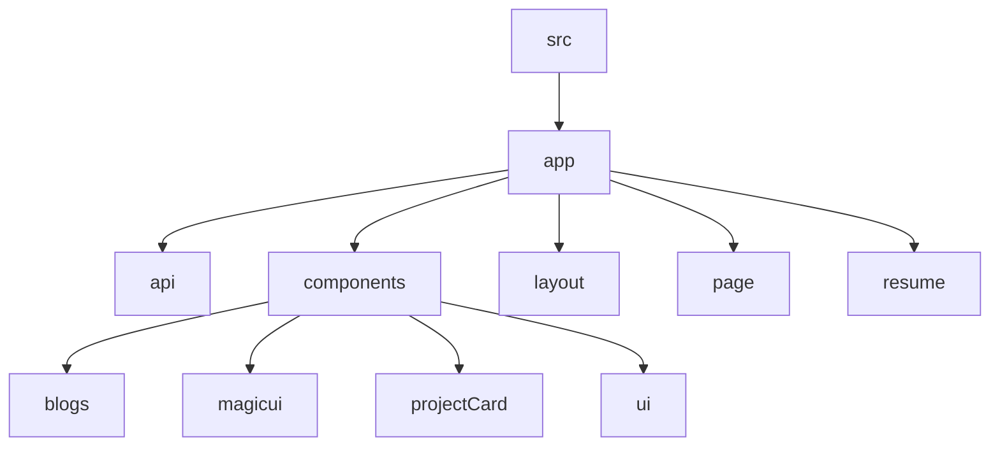

# Portfolio

## 🗂️ Description

This project is a personal portfolio website built using Next.js, TypeScript, and Tailwind CSS. It showcases various sections, including a hero section, social media links, bio, projects showcase, tech stack, photos, and articles. The website is designed to be visually appealing and interactive, with features like animated content and a theme switcher.

The portfolio website is intended for developers and individuals who want to showcase their projects and skills. It provides a clean and organized way to display projects, blogs, and other relevant information.

The website is built with a focus on reusability, maintainability, and scalability, making it easy to update and extend in the future.

## ✨ Key Features

### **Core Features**

* Personal portfolio website with various sections (hero, social media links, bio, projects showcase, tech stack, photos, and articles)
* Interactive globe and animated content
* Theme switcher with light and dark modes
* Projects showcase with customizable project cards
* Blog feature with API route to fetch blog data

### **UI Components**

* Reusable UI components (Button, AlertDialog, Marquee, Globe)
* Customizable project cards and blog cards

## 🗂️ Folder Structure

## 🛠️ Tech Stack

* Next.js
* TypeScript
* Tailwind CSS
* React
* ESLint
* PostCSS

## ⚙️ Setup Instructions

* Git clone the repository: https://github.com/abhraneeldhar7/portfolio.git
* Install dependencies: `npm install` or `yarn install`
* Start the development server: `npm run dev` or `yarn dev`
* Build the project: `npm run build` or `yarn build`
* Lint the code: `npm run lint` or `yarn lint`
