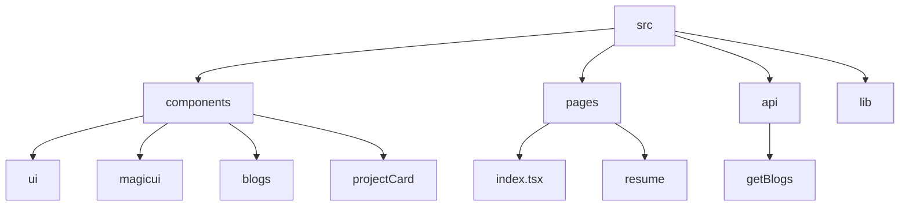

# Portfolio

## 🗂️ Description

This repository contains the code for a personal portfolio website. The portfolio showcases projects, blog posts, and other relevant information about the owner. It's built using Next.js, React, and various UI components.

The portfolio is designed to be open-source and can be cloned by anyone interested. However, the owner requests that similar portfolios be checked for originality to ensure that the work is not copied.

The website features a clean and modern design, with interactive elements and animations. It's a great example of a personal portfolio website built with modern web technologies.

## ✨ Key Features

### **UI Components**

* Reusable UI components, such as:
	+ Buttons
	+ Alert dialogs
	+ Project cards
	+ Blog cards
	+ Marquee
	+ Globe

### **Pages**

* Main page with hero sections, social media links, project showcases, and article listings
* Resume redirect page

### **API**

* API route for fetching blogs

### **Styling**

* Tailwind CSS integration
* PostCSS configuration

## 🗂️ Folder Structure

## 🛠️ Tech Stack

* Next.js
* React
* TypeScript
* Tailwind CSS
* PostCSS
* ESLint
* Shadcn UI components
* Cobe library for interactive globe

## ⚙️ Setup Instructions

* Git clone the repository: `https://github.com/abhraneeldhar7/portfolio.git`
* Install dependencies: `npm install` or `yarn install`
* Start the development server: `npm run dev` or `yarn dev`
* Open the website in a browser: `http://localhost:3000`
