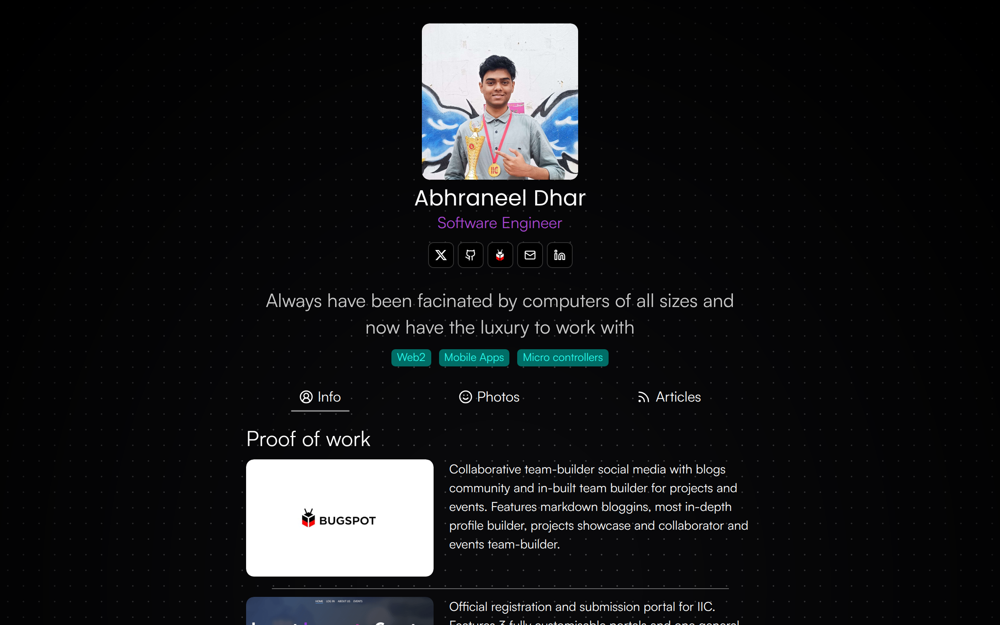
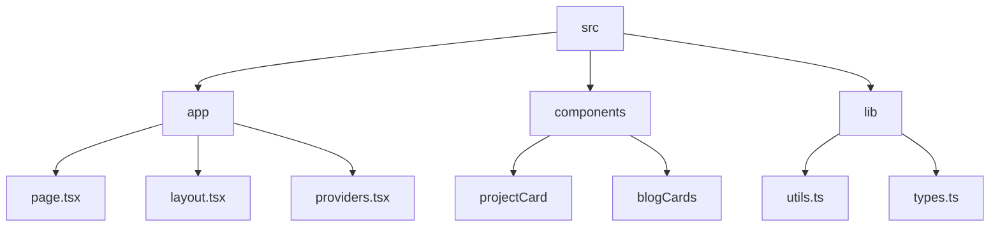

# Abhraneel Dhar's Portfolio

## 🗂️ Description

This repository contains the source code for my personal portfolio website, built using Next.js, React, and TypeScript. The website showcases my projects, blogs, and resume, and is designed to be a one-stop destination for anyone looking to learn more about me and my work. The website features a clean and modern design, with a focus on user experience and accessibility.

The portfolio website is built with a modular architecture, making it easy to maintain and update. It uses a range of technologies, including React, Next.js, TypeScript, and Tailwind CSS, to provide a fast, scalable, and secure user experience.

## ✨ Key Features

### **Core Features**

* **Project Showcase**: A section dedicated to showcasing my projects, with images, descriptions, and links to live demos or GitHub repositories.
* **Blog**: A section for my blog posts, where I share my thoughts on technology, programming, and more.
* **Resume**: A link to my resume, which provides a detailed overview of my experience, skills, and education.

### **Technical Features**

* **Theme Toggle**: A feature that allows users to switch between light and dark modes.
* **API Integration**: The website fetches blog data from an external API, demonstrating my ability to integrate with third-party services.
* **Responsive Design**: The website is designed to be fully responsive, providing a great user experience across a range of devices and screen sizes.

## 🗂️ Folder Structure

## 🛠️ Tech Stack

## ⚙️ Setup Instructions

To run the project locally, follow these steps:

* Clone the repository: `git clone https://github.com/abhraneeldhar7/portfolio.git`
* Install dependencies: `npm install` or `yarn install`
* Start the development server: `npm run dev` or `yarn dev`

## 📁 Configuration Files

The project uses a range of configuration files to manage dependencies, linting, and build settings. These files include:

* `next.config.ts`: Configures Next.js settings, including ESLint and image optimization.
* `.eslintrc.json`: Configures ESLint settings, including custom rules and extends.
* `tsconfig.json`: Configures TypeScript settings, including target JavaScript version and library files.
* `postcss.config.mjs`: Configures PostCSS settings, including Tailwind CSS.

## 📚 Utility Functions

The project uses a range of utility functions to simplify development and improve code quality. These functions include:

* `lib/utils.ts`: Exports utility functions for working with CSS class names, including `cn`.
* `lib/types.ts`: Exports type definitions for `ProjectType` and `BlogType`.