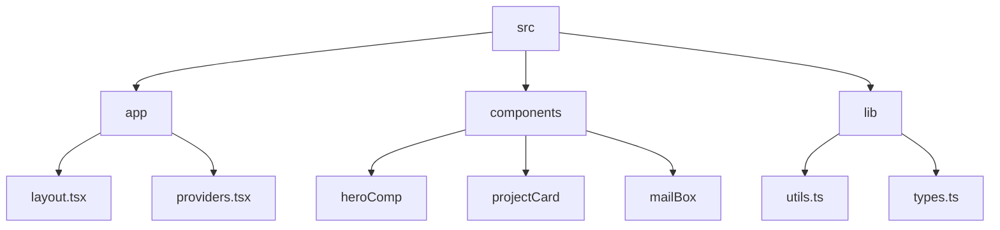

# Abhraneel Dhar's Portfolio

## 🗂️  Description

This repository contains the source code for my personal portfolio website, showcasing my projects, skills, and experiences as a developer. The portfolio is built using Next.js, TypeScript, and Tailwind CSS, with a focus on performance, accessibility, and visual appeal. This project is for anyone interested in learning more about my work, skills, and experiences.

The portfolio features a clean and modern design, with a responsive layout that adapts to different screen sizes and devices. It includes sections for projects, skills, and contact information, providing a comprehensive overview of my abilities and interests.

## ✨ Key Features

### **Core Features**

* **Project Showcase**: A showcase of my projects, with details on technologies used, project descriptions, and live links.
* **Skills**: A section highlighting my technical skills, including programming languages, frameworks, and tools.
* **Contact**: A contact form that allows visitors to send me a message.

### **UI Components**

* **Project Card**: A reusable component for displaying project information, with features like thumbnail images, project titles, descriptions, and links to source code and live links.
* **Hero Components**: Customizable hero components for different sections, such as front-end and designer.

## 🗂️ Folder Structure

## 🛠️ Tech Stack

## ⚙️ Setup Instructions

To run the project locally:

* Clone the repository: `git clone https://github.com/abhraneeldhar7/portfolio.git`
* Install dependencies: `npm install` or `yarn install`
* Start the development server: `npm run dev` or `yarn dev`

## 📁 Configuration Files

The project uses the following configuration files:

* `.eslintrc.json`: ESLint configuration file that extends Next.js and TypeScript configurations.
* `next.config.ts`: Next.js configuration file that sets up ESLint and image processing settings.
* `postcss.config.mjs`: PostCSS configuration file that sets up the Tailwind CSS plugin.
* `tsconfig.json`: TypeScript configuration file that sets up compiler options, includes, and excludes.

## 🤖 GitHub Actions

The project uses GitHub Actions for automated workflows, including:

* **Linting and Formatting**: Automated linting and formatting checks using ESLint and Prettier.
* **Build and Deployment**: Automated build and deployment of the portfolio website to a hosting platform.

  

<h3>Abhraneel Dhar</h3>

Full-stack developer with experience in web, Android, and server development. Most of their repositories are private due to containing production code.

 

  <a href="https://gitfull.vercel.app">Made by GitFull</a>

    