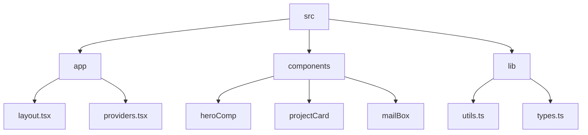

# Abhraneel Dhar's Portfolio

## 🗂️  Description

This repository contains the source code for my personal portfolio website, showcasing my projects, skills, and experience as a developer. The website is built using Next.js, TypeScript, and Tailwind CSS, and features a range of interactive components and animations.

The portfolio website is designed to provide a visually appealing and engaging experience for visitors, while also demonstrating my technical skills and expertise as a developer.

## ✨ Key Features

### **Core Features**

* Interactive project showcase with filtering and sorting capabilities
* Animated UI components and transitions
* Integration with Groq API for dynamic content generation
* Client-side email composition and sending functionality

### **Technical Features**

* Built with Next.js and TypeScript for performance and maintainability
* Styled with Tailwind CSS for a consistent and responsive design
* Utilizes ESLint and TypeScript for code quality and error detection

## 🗂️ Folder Structure

## 🛠️ Tech Stack

## ⚙️ Setup Instructions

To run the project locally, follow these steps:

* Clone the repository: `git clone https://github.com/abhraneeldhar7/portfolio.git`
* Install dependencies: `npm install` or `yarn install`
* Start the development server: `npm run dev` or `yarn dev`

## 🤖 GitHub Actions

The repository uses GitHub Actions for automated testing and deployment. The workflow is defined in the `.github/workflows/main.yml` file and includes steps for:

* Building and testing the project
* Deploying to a production environment

## 📝 Configuration Files

The project uses several configuration files to manage dependencies, scripts, and settings:

* `package.json`: contains metadata and dependencies for the project
* `next.config.ts`: configures Next.js settings and behavior
* `tsconfig.json`: configures TypeScript compiler settings
* `.eslintrc.json`: configures ESLint settings and rules
* `postcss.config.mjs`: configures PostCSS settings and plugins

## 📚 Utility Functions

The project includes several utility functions and types:

* `lib/utils.ts`: exports utility functions for working with CSS class names
* `lib/types.ts`: exports type definitions for the project

## 📊 Components

The project includes several React components:

* `components/heroComp/frontend.tsx`: displays a visual representation of a front-end development environment
* `components/projectCard/projectCard.tsx`: displays information about a project
* `components/mailBox/mailbox.tsx`: provides a UI for composing and sending emails

  

<h3>Abhraneel Dhar</h3>

Full-stack developer with experience in web, Android, and server development. Most of their work is private due to being production code.

 

  <a href="https://gitfull.vercel.app">Made by GitFull</a>

    