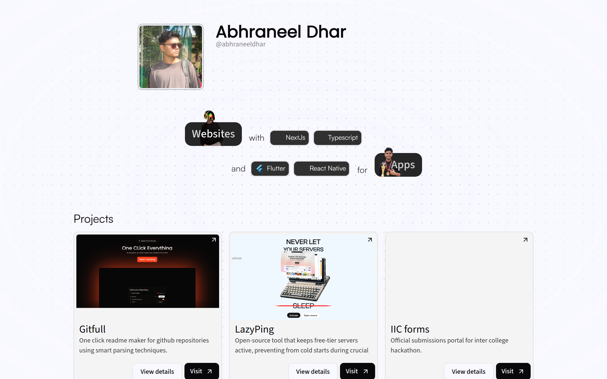
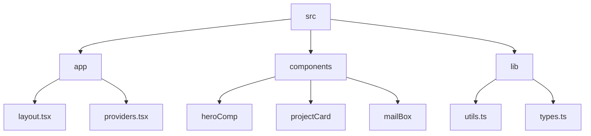

# Abhraneel Dhar's Portfolio

## 🗂️  Description

This repository contains the source code for my personal portfolio website, showcasing my projects, skills, and experiences as a developer. The portfolio is built using Next.js, TypeScript, and Tailwind CSS, and is designed to be a visually appealing and interactive representation of my work.

The portfolio features a range of projects, each with its own unique characteristics and technologies used. It also includes a mailbox interface for contacting me, as well as a story card component for displaying interactive stories.

## ✨ Key Features

### **Core Features**

* **Project Showcase**: A showcase of my projects, each with its own unique characteristics and technologies used.
* **Mailbox Interface**: A mailbox interface for contacting me.
* **Story Card Component**: An interactive story card component for displaying stories.

### **Design and Layout**

* **Responsive Design**: A responsive design that adapts to different screen sizes and devices.
* **Tailwind CSS**: Utilizes Tailwind CSS for styling and layout.

### **Interactivity**

* **AI-powered Email Generation**: The mailbox interface includes an option to use AI to generate email content.
* **Interactive Story Cards**: The story card component allows users to interact with the story through animations and timelines.

## 🗂️ Folder Structure

## 🛠️ Tech Stack

## ⚙️ Setup Instructions

To run the project locally, follow these steps:

* Clone the repository: `git clone https://github.com/abhraneeldhar7/portfolio.git`
* Install dependencies: `npm install`
* Start the development server: `npm run dev`

## 🤖 GitHub Actions

This repository uses GitHub Actions for continuous integration and deployment. The workflow is defined in the `.github/workflows/main.yml` file and includes the following steps:

* **Linting and Type Checking**: Runs ESLint and TypeScript checks on the codebase.
* **Building and Deploying**: Builds the project and deploys it to a hosting platform.

## 📝 Configuration Files

The project uses several configuration files to manage its settings and dependencies. These include:

* **`.eslintrc.json`**: ESLint configuration file.
* **`next.config.ts`**: Next.js configuration file.
* **`postcss.config.mjs`**: PostCSS configuration file.
* **`tsconfig.json`**: TypeScript configuration file.

  

<h3>Abhraneel Dhar</h3>

Full-stack developer with experience in web, Android, and server development. Most of their code is private due to being production code.

 

  <a href="https://gitfull.vercel.app">Made by GitFull</a>

    