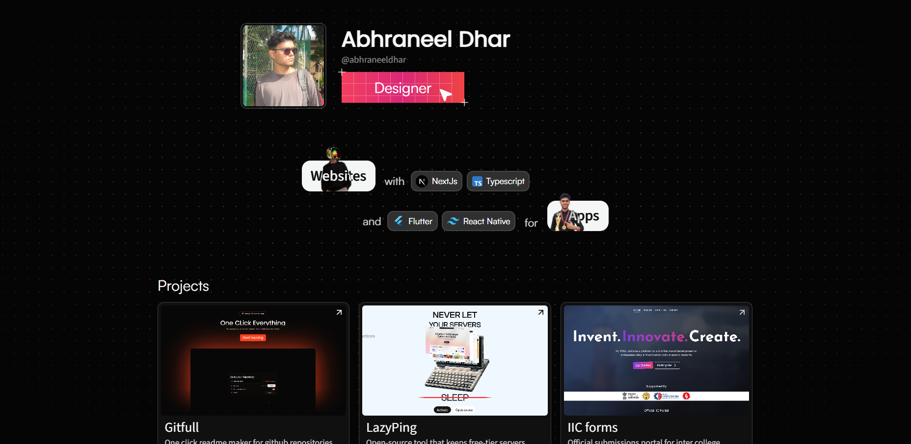
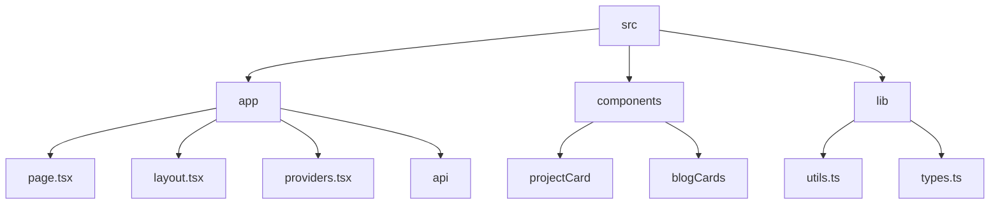

# Abhraneel Dhar's Portfolio

## 🗂️ Description

This repository contains the source code for my personal portfolio website, built using Next.js, TypeScript, and Tailwind CSS. The website showcases my projects, blog posts, and resume, and is designed to demonstrate my skills and experience as a developer. The portfolio is intended for anyone who wants to learn more about my work, including potential employers, collaborators, and fellow developers.

The website features a clean and modern design, with a focus on showcasing my projects and blog posts in a visually appealing way. It also includes a theme toggle button, allowing users to switch between light and dark modes.

## ✨ Key Features

### **Projects**
* Project cards with images, descriptions, tech stacks, and links to GitHub, live links, and blog posts
* Project data stored in a typesafe format using TypeScript interfaces

### **Blog Posts**
* Blog post cards with images, titles, text content, and links to the blog post
* API route for retrieving blog posts from an external API

### **Resume**
* Resume redirect component that redirects users to a resume PDF file

### **Theme and Styling**
* Theme provider using `next-themes`
* Global CSS styles and Tailwind CSS configuration
* Utility functions for working with CSS class names

## 🗂️ Folder Structure

## 🛠️ Tech Stack

## ⚙️ Setup Instructions

To run the project locally, follow these steps:

* Clone the repository: `git clone https://github.com/abhraneeldhar7/portfolio.git`
* Install dependencies: `npm install` or `yarn install`
* Start the development server: `npm run dev` or `yarn dev`

## GitHub Actions

The repository uses GitHub Actions to automate tasks such as linting and building the project. The workflow is defined in the `.github/workflows` directory.

## Configuration Files

The project uses several configuration files to manage dependencies, linting, and TypeScript settings. These files include:

* `package.json`: project metadata and dependencies
* `.eslintrc.json`: ESLint configuration
* `tsconfig.json`: TypeScript configuration
* `next.config.ts`: Next.js configuration
* `postcss.config.mjs`: PostCSS configuration
* `components.json`: Shadcn configuration

## API Routes

The project defines an API route for retrieving blog posts:

* `app/api/getBlogs/route.ts`: API route for retrieving blog posts from an external API

## Components

The project uses several React components to render the portfolio website:

* `app/page.tsx`: main page component
* `components/projectCard/projectCard.tsx`: project card component
* `components/blogCards/blogCards.tsx`: blog post card component
* `app/layout.tsx`: root layout component
* `app/providers.tsx`: theme provider component

  

<h3>Abhra the Neel</h3>

Full-stack developer with expertise in web, Android, and server-side development. Most projects are private due to being production code.

 

  <a href="https://gitfull.vercel.app">Made by GitFull</a>

    