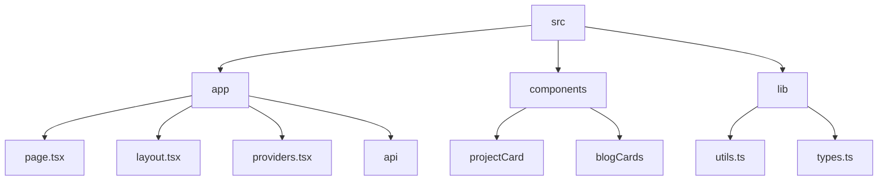

# Abhraneel Dhar's Portfolio

## 🗂️ Description

This repository contains the source code for Abhraneel Dhar's portfolio website, a personal project showcasing his skills, experience, and achievements. The website is built using Next.js, TypeScript, and Tailwind CSS, and features a clean, modern design. It's designed for anyone looking to learn more about Abhraneel's work, skills, and experience.

The portfolio website includes sections for projects, blog posts, tech stack, and more. It's a great example of a personal portfolio website, and can serve as a starting point for anyone looking to build their own.

## ✨ Key Features

### **Core Features**
* Personal portfolio website with projects, blog posts, and tech stack
* Built with Next.js, TypeScript, and Tailwind CSS
* Modern, responsive design

### **Components**
* Reusable UI components for projects and blog posts
* Theme management with dynamic switching

### **APIs**
* API route for fetching blog data

## 🗂️ Folder Structure

## 🛠️ Tech Stack

* Next.js
* TypeScript
* Tailwind CSS
* React
* ESLint
* PostCSS

## ⚙️ Setup Instructions

* Git clone: https://github.com/abhraneeldhar7/portfolio.git
* Install dependencies: `npm install` or `yarn install`
* Start development server: `npm run dev` or `yarn dev`
* Build and deploy: `npm run build` or `yarn build`