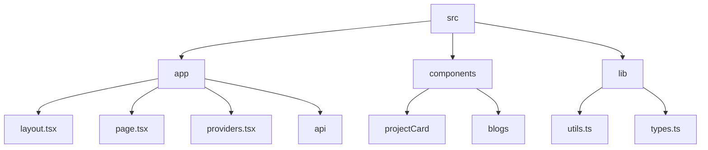

# Abhraneel Dhar's Portfolio

## 🗂️ Description

This repository contains the source code for my personal portfolio website, built using Next.js, React, and TypeScript. The website showcases my projects, blog posts, and resume, and is designed to be a one-stop destination for anyone looking to learn more about me and my work. The portfolio is structured into three main sections: 'Proof of work' (projects), 'Photos', and 'Articles' (blog posts), providing a clear and concise overview of my accomplishments and experiences.

## ✨ Key Features

### **Core Features**

* **Project Showcase**: A section dedicated to showcasing my projects, with descriptions, images, and links to GitHub and live links.
* **Blog**: A section for my blog posts, with summaries and links to read more.
* **Resume**: A link to my resume, easily accessible from the website.

### **Technical Features**

* **Theme Management**: The website features a theme toggle button, allowing users to switch between light and dark modes.
* **API Integration**: The website fetches blog data from an external API route (`/api/getBlogs`).
* **TypeScript and Next.js**: The website is built using TypeScript and Next.js, providing a robust and scalable foundation.

## 🗂️ Folder Structure

## 🛠️ Tech Stack

## ⚙️ Setup Instructions

To run the project locally, follow these steps:

* Git clone the repository: `https://github.com/abhraneeldhar7/portfolio.git`
* Install dependencies: `npm install` or `yarn install`
* Start the development server: `npm run dev` or `yarn dev`

## 📁 Configuration Files

The project uses several configuration files to manage its dependencies and settings:

* **`.eslintrc.json`**: Configures ESLint, a JavaScript linter, for the project.
* **`next.config.ts`**: Configures Next.js, a React-based framework, for the project.
* **`postcss.config.mjs`**: Configures PostCSS, a CSS post-processor, with the Tailwind CSS plugin.
* **`tsconfig.json`**: Configures the TypeScript compiler for the project.

## 📚 API Documentation

The project features an API route (`/api/getBlogs`) that fetches blog data from an external API and returns it in JSON format. This route is used by the `page.tsx` component to display blog posts on the website.

  

<h3>Abhra the Neel</h3>

Full-stack developer with expertise in web, Android, and server-side development. Most projects are private due to being production code.

 

  <a href="https://www.gitfull.vercel.app">Made by GitFull</a>

    